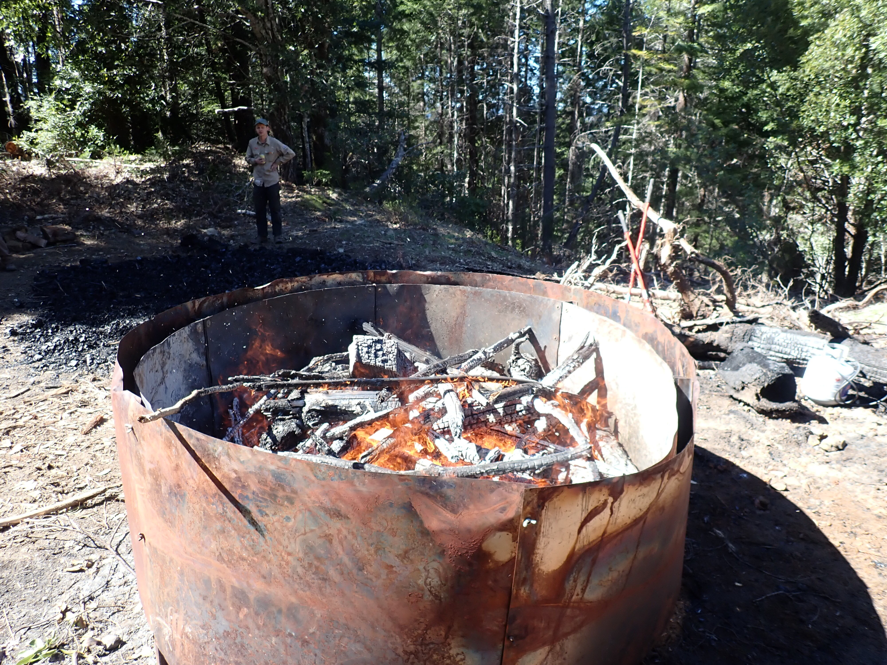

# Community Wildfire Fuel Reduction Modeling Tool

## Biochar in Community Wildfire Resilience
Community wildfire fuel reduction is increasingly important, and biochar production can be an excellent technique for processing removed vegetation—but it's not always the right answer. The challenge is that regular community members and planners need tools to explore their options without being specialists in forestry, chemistry, or logistics. This project aims to bridge that gap by letting users "game out" different treatment plans in terms of cost, emissions, time, and risk.

Geography matters enormously when planning biochar operations. Biochar production requires water for quenching, road access for transporting equipment and product, and proximity to fuel sources—but not too close. Some areas may be too steep, some fuels may not be suited to biochar at all, and different parts of a treatment area can have completely different optimal solutions. Traditional models often treat a treatment area as a simple sum of its parts without considering spatial relationships, missing these crucial geometric factors.

How It Works
* Start with community data: Import map data from community or open sources—roads, water sources, topography, buildings, and local requirements
* Sketch a treatment plan: Plans can be imported from practitioners or created using web app tools; the approach emphasizes being light and iterative while remaining precise and open
* Score and compare: Treatment plans are evaluated along multiple axes and visualized with radar graphs for easy comparison
* Export outputs: Results can feed into practitioner workflows, grant documents, spreadsheets, or maps
